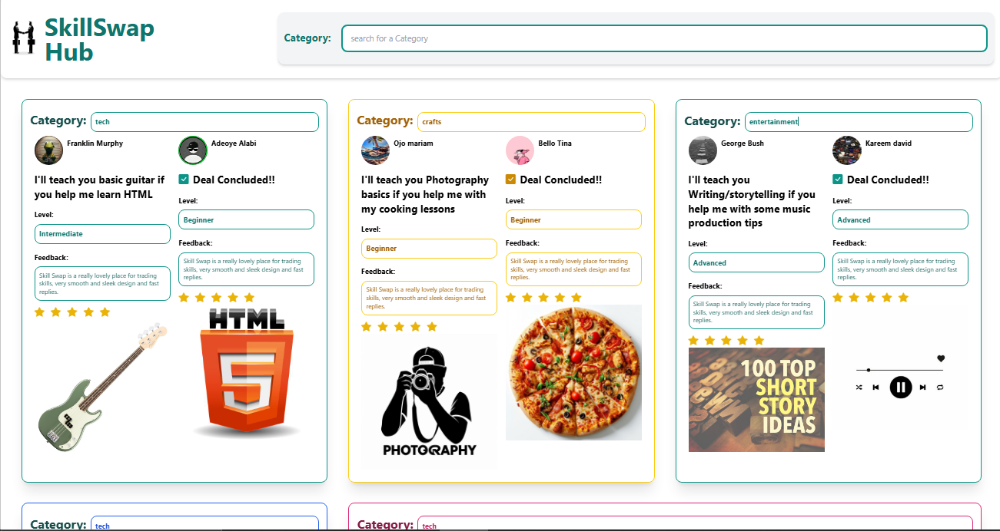

## ✅ MyProjectName
The name of this project is SkillSwap Hub.

# Portolio 



# Summary
A modern skill exchange platform where users can trade their knowledge and expertise with others in the community.

# ✨ Features
The SkillSwap Hub includes the following powerful and user-friendly features:
🔍 Smart Search & Filtering
Real-time category search to quickly find specific skill exchanges
🎯 Skill Categories
Browse diverse skill categories including Music, Photography, Technology, Creative Arts, Languages, and more
👥 User Profiles
View detailed user profiles with skill levels, feedback, and ratings
⭐ Rating System
5-star rating system to build trust within the community
📱 Fully Responsive Design
Optimized layout that works perfectly on mobile, tablet, and desktop screens
🎨 Modern UI/UX
Clean, colorful design with smooth animations and interactive elements
🤝 Deal Tracking
Visual indicators for completed skill exchanges and ongoing negotiations
📋 Skill Levels
Clear indication of skill proficiency (Beginner, Intermediate, Advanced)


## 🛠️ Technologies Used
| Category        | Technologies                          |
|-----------------|---------------------------------------|
| 🖥️ Frontend     | Vue 3, Tailwind CSS, Hero Icons       |
| 🎨 Styling      | Tailwind CSS, AOS                     |
| 🚀 Build Tools  | 	Vite                                 |
| 🧠 State Mgm    | VueUse                                | 
| 🌍 Deployment   | Vercel                                |

## 🚀 Installation

1. Clone the repository:
   ```bash
   git clone https://github.com/yourusername/project-dashboard.git

## 🤝 Contributing
Contributions are welcome!  
Please fork the repo and create a pull request.
1. Fork the Project  
2. Create your Feature Branch (`git checkout -b feature/AmazingFeature`)  
3. Commit your Changes (`git commit -m 'Add some AmazingFeature'`)  
4. Push to the Branch (`git push origin feature/AmazingFeature`)  
5. Open a Pull Request


## 📬 Contact
Made by @Ifedollars99
**Hamzah Taofeeq ifedolapo**  
📧 taofeeqifedollar@gmail.com  
🔗 [LinkedIn](https://www.linkedin.com/in/taofeeq-ifedolapo-7890162ba?utm_source=share&utm_campaign=share_via&utm_content=profile&utm_medium=android_app) 
| [Twitter](https://x.com/IfedollarsAvr?t=KWrkgQdZLuh7Y7xaCLCWeg&s=09)
# Ghost of the System 👻

📄 License
This project is licensed under the MIT License - see the LICENSE.md file for details.

Building Connections Through Skills 🤝✨

